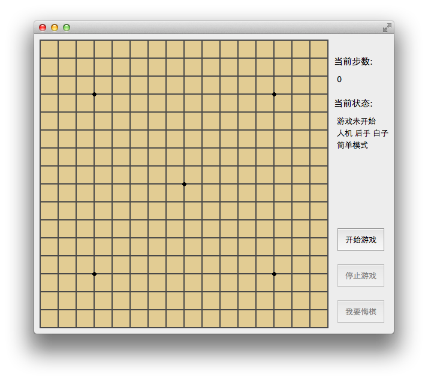

Five
====
A Qt five-in-a-row Game

_WARNING: THIS PROJECT CONTAINS REALLY BAD CODE, I WAS SO STUPID, AND NO UPDATE PLAN SO FAR!!!_

Description
-----------

* Written in Mac OS X. It might have code format problem in Windows.

* AI is not so smart.

* Support three game modes.

* Support save and load game state.

LICENSE
-------
The GPL License. Read [GNU General Public License](http://www.gnu.org/licenses/gpl.html) for further information.